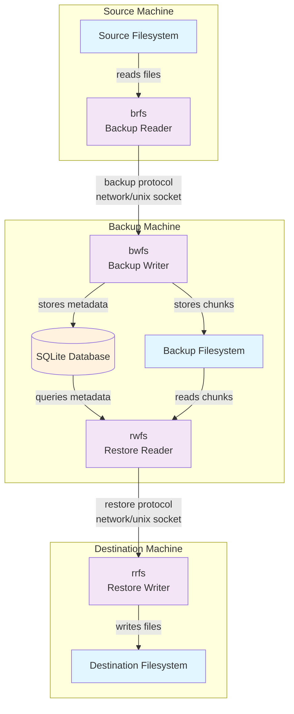

# System Architecture
A backup system with intelligent deduplication and integrity verification.

## System Overview

See the System Architecture Diagram showing the complete data flow between components and filesystems.

## Component Connectivity
### Backup Process:

- **brfs** reads files from standard filesystem
- Connects to bwfs via network or Unix socket
- Generates data streams with chunked file content
- bwfs writes needed data to filesystem and metadata to SQLite database

### Restore Process:
**rwfs** reads data from filesystem and queries SQLite database
- Connects to rrfs via network or Unix socket
- Generates data streams to reconstruct files
- rrfs writes files to standard filesystem
