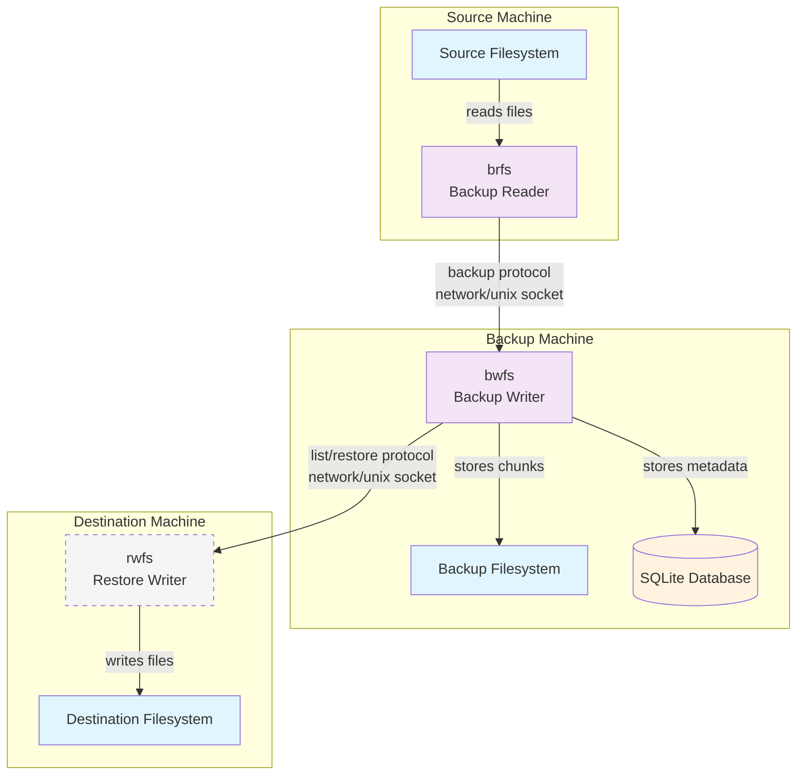

# System Architecture
A backup system with intelligent deduplication and integrity verification.

## Components

| Component | Full name | Status |
|-----------|-----------|--------|
| brfs | Backup Reader for File System — reads files from source, sends via gRPC | Implemented |
| bwfs | Backup Writer for File System — receives via gRPC, stores chunks + metadata | Implemented |
| rwfs | Restore Writer for File System — queries bwfs (list, future restore) and writes to destination | list implemented; restore not yet implemented |

## Backup Process

- **brfs** reads files from the source filesystem
- Connects to **bwfs** via network or Unix socket
- Sends chunked file data using the backup protocol
- **bwfs** stores needed chunks on the backup filesystem and records metadata in SQLite

## Restore Process _(planned)_

- **rwfs** connects to **bwfs** via network or Unix socket using the list/restore protocol
- **rwfs list** queries metadata from the remote **bwfs** server
- **rwfs** (future restore) reconstructs files on the destination filesystem

## Data Flow

```mermaid
graph TB
    subgraph "Source Machine"
        SrcFS[Source Filesystem]
        brfs[brfs<br/>Backup Reader]
    end

    subgraph "Backup Machine"
        bwfs[bwfs<br/>Backup Writer]
        BackupFS[Backup Filesystem]
        DB[(SQLite Database)]
    end

    subgraph "Destination Machine"
        rwfs[rwfs<br/>Restore Writer]
        DstFS[Destination Filesystem]
    end

    %% Backup Flow
    SrcFS -->|reads files| brfs
    brfs -->|backup protocol<br/>network/unix socket| bwfs
    bwfs -->|stores chunks| BackupFS
    bwfs -->|stores metadata| DB

    %% Restore Flow (planned)
    bwfs -->|list/restore protocol<br/>network/unix socket| rwfs
    rwfs -->|writes files| DstFS

    classDef filesystem fill:#e1f5fe
    classDef component fill:#f3e5f5
    classDef planned fill:#f5f5f5,stroke-dasharray:5
    classDef database fill:#fff3e0

    class SrcFS,BackupFS,DstFS filesystem
    class brfs,bwfs component
    class rwfs planned
    class DB database
```
