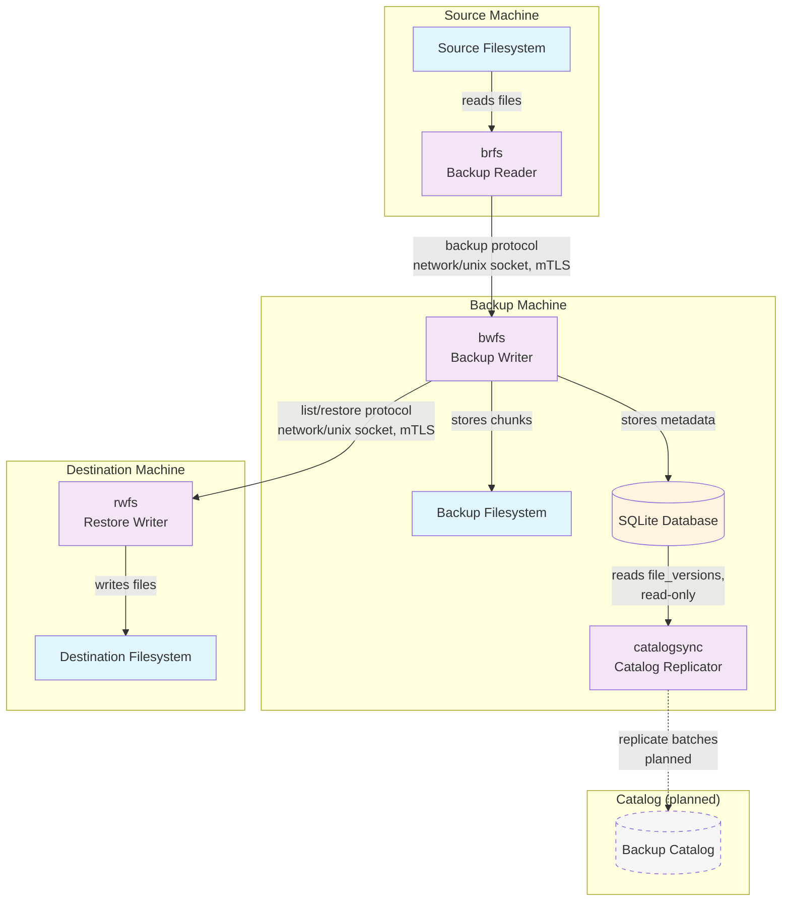

# System Architecture
A backup system with intelligent deduplication and integrity verification.

## Components

| Component | Full name | Status |
|-----------|-----------|--------|
| brfs | Backup Reader for File System — reads files from source, sends via gRPC | Implemented |
| bwfs | Backup Writer for File System — receives via gRPC, stores chunks + metadata | Implemented |
| rwfs | Restore Writer for File System — queries bwfs (list, verify; restore TBD) | list + verify implemented; full restore not yet implemented |
| catalogsync | Replicates a bwfs node's file_versions to a backup catalog | Implemented (catalog service itself not yet built) |

## Control Plane vs. Agents

|  | Control plane | Agents |
|---|---|---|
| Components | `ca/` (step-ca container), `certrequest` | `bwfs`, `brfs`, `rwfs`, `certclient` |
| Runs where | On/near the CA host | On every backup node |
| Network role | Serves enrollment/renewal/admin (`/sign`, `/renew`, `/roots`, `/provisioners`) on `:9000`; has no role in backup traffic | Dial `ca_host:9000` outbound only, for enrollment/renewal; otherwise mesh with each other over gRPC on `:8080` (mTLS) |
| Docker/e2e images | `certrequest` never ships onto an agent host or into an agent image | Agent images bundle `certclient` only |

A node's mTLS identity (`ca.crt`, `client.crt`, `client.key`, consumed by `common/mtls`) is
obtained via `certclient`, using a token minted by `certrequest`. See
[certrequest](components/certrequest.md) and [certclient](components/certclient.md).

## Backup Process

- **brfs** reads files from the source filesystem
- Connects to **bwfs** via network or Unix socket, authenticated with mutual TLS
- Sends chunked file data using the backup protocol
- **bwfs** stores needed chunks on the backup filesystem and records metadata in SQLite

## Restore/Verify Process

- **rwfs** connects to **bwfs** via network or Unix socket using the list/restore protocol, authenticated with mutual TLS
- **rwfs list** queries metadata from the remote **bwfs** server
- **rwfs verify** fetches all chunks and re-verifies BLAKE3 and CRC32 integrity without writing to disk
- **rwfs** (future restore) reconstructs files on the destination filesystem

## Data Flow

```mermaid
graph TB
    subgraph "Source Machine"
        SrcFS[Source Filesystem]
        brfs[brfs<br/>Backup Reader]
    end

    subgraph "Backup Machine"
        bwfs[bwfs<br/>Backup Writer]
        BackupFS[Backup Filesystem]
        DB[(SQLite Database)]
        catalogsync[catalogsync<br/>Catalog Replicator]
    end

    subgraph "Catalog (planned)"
        Catalog[(Backup Catalog)]
    end

    subgraph "Destination Machine"
        rwfs[rwfs<br/>Restore Writer]
        DstFS[Destination Filesystem]
    end

    %% Backup Flow
    SrcFS -->|reads files| brfs
    brfs -->|backup protocol<br/>network/unix socket, mTLS| bwfs
    bwfs -->|stores chunks| BackupFS
    bwfs -->|stores metadata| DB

    %% Restore Flow (list/verify implemented)
    bwfs -->|list/restore protocol<br/>network/unix socket, mTLS| rwfs
    rwfs -->|writes files| DstFS

    %% Catalog Replication Flow (bwfs's own operation is unaffected either way)
    DB -->|reads file_versions,<br/>read-only| catalogsync
    catalogsync -.->|replicate batches<br/>planned| Catalog

    classDef filesystem fill:#e1f5fe
    classDef component fill:#f3e5f5
    classDef planned fill:#f5f5f5,stroke-dasharray:5
    classDef database fill:#fff3e0

    class SrcFS,BackupFS,DstFS filesystem
    class brfs,bwfs,catalogsync component
    class rwfs component
    class DB database
    class Catalog planned
```
