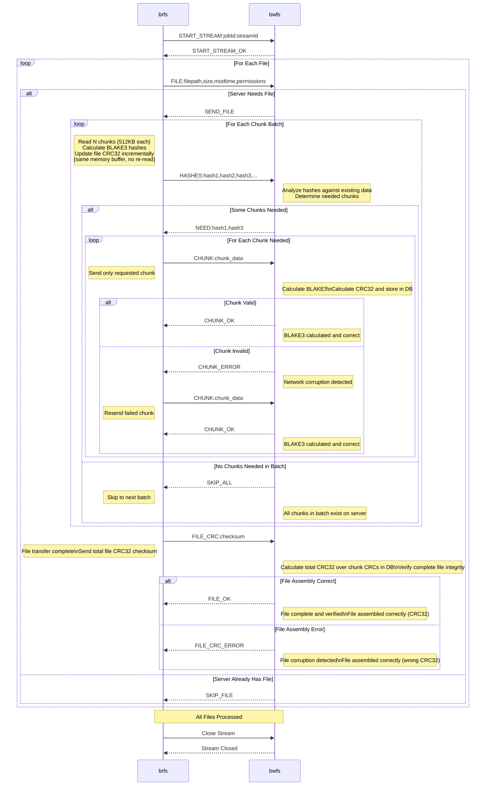

# Chunked Backup Protocol - Design Overview

## **Core Concept**
A dual-layer integrity system with smart deduplication that processes files in 512KB chunks, optimizing for both network efficiency and data reliability.

## **Protocol Flow**
1. **File-level filtering**: Send metadata first, get `SEND_FILE` or `SKIP_FILE` to avoid unnecessary processing
2. **Chunk-based transfer**: Split files into 512KB chunks, send hash batches, receive selective requests  
3. **Dual integrity verification**: BLAKE3 per-chunk + CRC32 whole-file validation

## **Key Design Decisions**

**Why 512KB chunks?**
- Optimal balance: large enough for network efficiency, small enough for granular deduplication
- Memory-friendly: predictable RAM usage regardless of file size
- **Future evolution**: Fixed 512KB will be replaced with variable chunk sizes (content-defined chunking) commonly used in advanced deduplication systems for better efficiency

**Why batch hashes but send chunks individually?**
- Hashes are small (~32 bytes) → efficient to batch
- Chunks are large (512KB) → individual sending avoids massive memory buffers

**Why dual integrity (BLAKE3 + CRC32)?**
- **BLAKE3**: Ensures each chunk survives network transmission intact
- **CRC32**: Verifies complete file assembly (correct order, no missing chunks)
- Composable CRC32 calculated during read → no extra I/O overhead

**Why file-level pre-filtering?**
- Server decides upfront: "Do I need this file at all?"
- Eliminates hash calculation and chunk processing for existing files
- Massive efficiency gain for incremental backups

