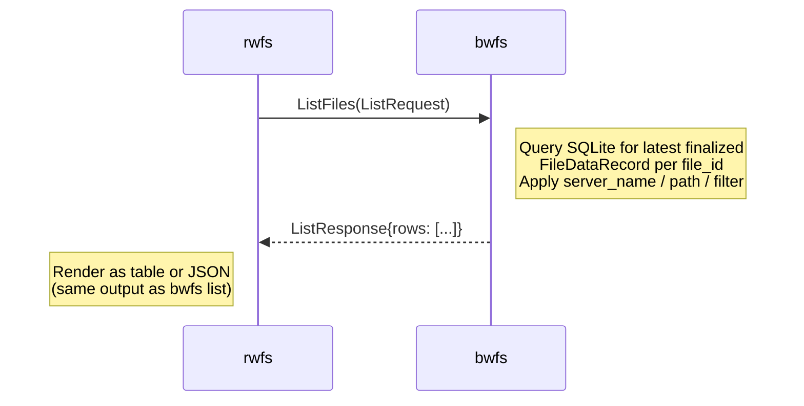

# List Subprotocol - Design Overview

## Core Concept

A simple unary gRPC RPC that returns all finalized file records from a `bwfs` storage, with optional filtering by source hostname, path prefix, and free-text substring. Both `bwfs list` (local SQLite read) and `rwfs list` (remote gRPC call) produce identical output for identical data, sharing the same query logic and rendering code (`common/listformat`).

## Protocol Definition

```proto
service ListService {
  rpc ListFiles(ListRequest) returns (ListResponse);
}

message ListRequest {
  string server_name = 1; // exact hostname filter; empty = all sources
  string path        = 2; // prefix filter on file path; empty = no filter
  string filter      = 3; // free-text substring filter; empty = no filter
}

message ListResponse {
  repeated FileRow rows = 1;
}

message FileRow {
  string file_uuid     = 1;
  string source        = 2;
  string type          = 3;
  string path          = 4;
  int64  timestamp      = 5; // Unix mtime from file ID
  int64  size           = 6; // bytes
  int32  chunks         = 7;
  int64  versions       = 8; // distinct FileVersionRecords for this file
  string created_at     = 9; // RFC3339 UTC — when this FileDataRecord was finalized
}
```

`ListService` is registered on the same `grpc.Server` as `BackupService`, so a single `bwfs server` process serves both protocols on the same port.

## Protocol Flow



The RPC is unary (not streaming): the server collects all matching rows from SQLite and returns them in a single response. This is appropriate because backup catalogs are expected to contain thousands of entries per host, not millions — streaming adds complexity with no meaningful latency benefit at this scale.

## Filter Semantics

All three filters are optional and compose with AND:

| Field | Match type | Applied in |
|-------|------------|-----------|
| `server_name` | Exact match against the hostname token in the file ID | SQL (`WHERE file_id LIKE 'fs://hostname:%'`) |
| `path` | Prefix match against the decoded path component | Go post-query (path is embedded in file ID, not a separate column) |
| `filter` | Substring match against the full file ID | SQL (`WHERE file_id LIKE '%term%'`) |

**File ID format:** `fs://hostname:type:path:mtime`  
Example: `fs://workstation:f:/var/log/nginx/access.log:1782605538`

`server_name` matches the `hostname` token exactly. `path` matches the decoded `path` component as a prefix. The path prefix filter is applied in Go rather than SQL because the path is not a fixed-offset column inside the composite file ID string.

## CLI → RPC mapping

Both `bwfs list` and `rwfs list` accept a `[[server_name:]path]` positional that maps directly to `ListRequest` fields after first-colon splitting:

```
bwfs /store list myhost:/var/log --filter nginx
  → server_name="myhost", path="/var/log", filter="nginx"

rwfs list myhost:/var/log localhost:8080 --filter nginx
  → ListRequest{server_name="myhost", path="/var/log", filter="nginx"}
```

When no `[[server_name:]path]` positional is given to `rwfs list`, `server_name` defaults to `common.GetHostname()` — matching what `brfs` uses as the source label, so a bare `rwfs list <host:port>` shows the files backed up from the current machine.

## Output Format

Both `bwfs list` and `rwfs list` produce identical output via `common/listformat`:

**Table** (default):
```
SOURCE       TYPE  PATH                 TIMESTAMP   SIZE    CHUNKS  VERSIONS
workstation  f     /var/log/syslog      1782605538  1 MB    2       3
```

**JSON** (`--output json`):
```json
[
  {
    "file_uuid": "a1b2c3d4",
    "source": "workstation",
    "type": "f",
    "path": "/var/log/syslog",
    "timestamp": 1782605538,
    "size": 1048576,
    "chunks": 2,
    "versions": 3,
    "created_at": "2026-06-30T12:00:00Z"
  }
]
```

`created_at` is always RFC3339 UTC. The JSON field names are stable and consumed by e2e tests.

## Key Design Decisions

**Why unary RPC instead of server streaming?**  
Backup catalogs at this scale (thousands of files per host) fit comfortably in a single response. A streaming approach would complicate client-side rendering and error handling without meaningful benefit.

**Why register on the same port as BackupService?**  
Avoids a second listener, simplifies firewall rules, and keeps `bwfs server` as a single process with a single port. gRPC multiplexes services over the same HTTP/2 connection automatically.

**Why does `bwfs list` read SQLite directly instead of calling ListService?**  
The local read avoids a network round-trip and keeps the local path simple. Both paths share `queryFileRows` (same SQL query, same filter logic) and `common/listformat` (same rendering), so they produce identical output.

**Why is `path` filtering done in Go rather than SQL?**  
The path is embedded inside the composite `file_id` string (`fs://host:type:path:mtime`). Extracting it for a SQL `LIKE` prefix match would require fragile string slicing inside SQLite. Post-query filtering in Go is simpler and correct; result sets per host are small enough that it is not a performance concern.
