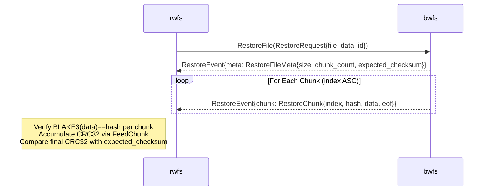

# Restore Subprotocol - Design Overview

## Core Concept

A server-streaming gRPC RPC (`RestoreService.RestoreFile`) that sends file metadata
followed by all chunks for a single file in index order. `bwfs` serves the data as-is;
it does not verify integrity before sending. The caller is responsible for any
integrity checks.

`RestoreService` is registered on the same `grpc.Server` as `BackupService` and
`ListService`, so no additional port or process is needed.

## Protocol Definition

```proto
service RestoreService {
  rpc RestoreFile(RestoreRequest) returns (stream RestoreEvent);
}

message RestoreRequest {
  string file_data_id = 1;  // FileDataRecord.ID from ListResponse
}

message RestoreEvent {
  oneof payload {
    RestoreFileMeta meta  = 1;  // first event only
    RestoreChunk    chunk = 2;  // one per chunk, in index order
  }
}

message RestoreFileMeta {
  int64  size              = 1;
  int32  chunk_count       = 2;
  bytes  expected_checksum = 3;  // 4-byte big-endian CRC32 from FileDataRecord.Checksum
}

message RestoreChunk {
  int64 index = 1;  // byte offset of this chunk in the original file
  bytes hash  = 2;  // BLAKE3 hash from storage (for client-side integrity check)
  bytes data  = 3;
  bool  eof   = 4;  // true on the last chunk
}
```

## Protocol Flow



## Error Handling

| Condition | bwfs behaviour |
|-----------|----------------|
| `file_data_id` not found or not finalized | gRPC `NotFound` |
| Chunk file missing or unreadable | gRPC `Internal` (stream terminates) |
| Send error (network) | stream terminates; client retries entire `RestoreFile` call |

## CLI → RPC Mapping

`rwfs verify` calls `ListService.ListFiles` first (same filters as `rwfs list`), then
calls `RestoreFile` for each returned `file_data_id`:

```
rwfs verify myhost:/var/log localhost:8080 --filter nginx
  1. ListFiles{server_name="myhost", path="/var/log", filter="nginx"}
  2. For each FileRow: RestoreFile{file_data_id=row.file_data_id}
```

## Key Design Decisions

**Why server-streaming per file instead of bidi streaming?**
One stream per file means a stream error affects only one file. The worker pool in rwfs
handles concurrency without needing multiplexed bidi state.

**Why does bwfs send the BLAKE3 hash alongside chunk data?**
So the client can detect storage-level corruption (bytes that changed after the chunk was
stored) without prior knowledge of the expected hash.

**Why does bwfs not re-verify BLAKE3 before sending?**
bwfs trusts its own storage. Detecting corruption after the fact is exactly the purpose
of `rwfs verify`.

**Why is `expected_checksum` sent in `RestoreFileMeta` rather than a separate RPC?**
Collocating the checksum with the stream eliminates an extra round-trip and lets the
client verify atomically at the end of each stream.
