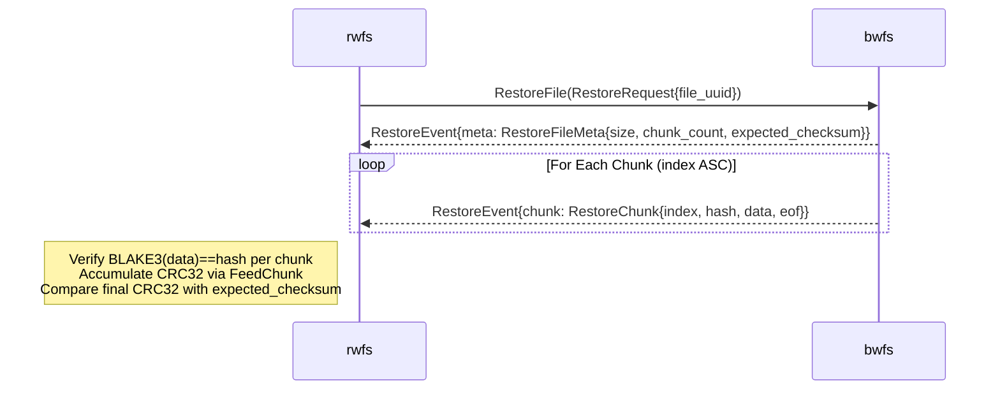

# Restore Subprotocol - Design Overview

## Core Concept

A server-streaming gRPC RPC (`RestoreService.RestoreFile`) that sends file metadata
followed by all chunks for a single file in index order. The client verifies every
chunk's BLAKE3 hash and the whole file's CRC32; that is what protects the restored data.
`bwfs` also checks each chunk's hash before sending it, so that it can identify a bad
chunk and heal it (see [Error Handling](#error-handling)).

`bwfs` locates all of a file's chunks with one database query (the file's links, in index
order, left-joined to their chunk rows) and then reads each chunk from its segment. A link
whose chunk row is gone stays in the list and fails at its position, which marks it. The
restore does not hold the store's guard, so compaction may move a chunk after that query;
a read that finds its segment gone looks the chunk up again instead of trusting the stale
location.

`RestoreService` is registered on the same `grpc.Server` as `BackupService` and
`ListService`, so no additional port or process is needed.

## Protocol Definition

```proto
service RestoreService {
  rpc RestoreFile(RestoreRequest) returns (stream RestoreEvent);
}

message RestoreRequest {
  string file_uuid = 1;  // FileDataRecord.UUID from a ListFiles / ResolveRestoreFiles FileRow
}

message RestoreEvent {
  oneof payload {
    RestoreFileMeta meta  = 1;  // first event only
    RestoreChunk    chunk = 2;  // one per chunk, in index order
  }
}

message RestoreFileMeta {
  int64  size              = 1;
  int32  chunk_count       = 2;
  bytes  expected_checksum = 3;  // 4-byte big-endian CRC32 from FileDataRecord.Checksum
}

message RestoreChunk {
  int64 index = 1;  // byte offset of this chunk in the original file
  bytes hash  = 2;  // BLAKE3 hash from storage (for client-side integrity check)
  bytes data  = 3;
  bool  eof   = 4;  // true on the last chunk
}
```

## Protocol Flow


```mermaid
sequenceDiagram
    participant Client as rwfs
    participant Server as bwfs

    Client->>Server: RestoreFile(RestoreRequest{file_uuid})
    Server-->>Client: RestoreEvent{meta: RestoreFileMeta{size, chunk_count, expected_checksum}}
    loop For Each Chunk (index ASC)
        Server-->>Client: RestoreEvent{chunk: RestoreChunk{index, hash, data, eof}}
    end
    Note left of Client: Verify BLAKE3(data)==hash per chunk<br/>Accumulate CRC32 via FeedChunk<br/>Compare final CRC32 with expected_checksum
```

## Authorization

`RestoreFile` requires the caller's operating certificate to carry the `client` role — `rwfs` is
the only legitimate caller. See
[Design: Role-Based gRPC Authorization](../superpowers/specs/2026-08-22-role-based-grpc-authz-design.md).

## Error Handling

| Condition | bwfs behaviour |
|-----------|----------------|
| `file_uuid` not found or not finalized | gRPC `NotFound` |
| Chunk missing or corrupt (`ErrChunkNotFound` / `ErrChunkCorrupt`) | gRPC `Internal` (stream terminates); chunk marked corrupted |
| Other chunk read error (I/O, too many open files, database busy) | gRPC `Internal` (stream terminates); nothing is marked |
| Send error (network) | stream terminates; client retries entire `RestoreFile` call |

When the chunk is missing or corrupt (and only then), bwfs also marks it corrupted server-side (deletes its
DB records, and invalidates the `FileData` of every file
that referenced it) before returning the `Internal` error — see the [backup
protocol](./backup.md)'s "How does the system recover from a corrupted chunk?" section for
the full recovery rationale. A `restore` or `verify` run doubles as the trigger for this
self-healing: the next backup re-uploads the affected files. Other read errors may be transient, so
they only fail the request: marking would drop data that is still intact.

## CLI → RPC Mapping

`rwfs verify` calls `ListService.ListFiles` first (same filters as `rwfs list`), then
calls `RestoreFile` for each returned `file_uuid`:

```
rwfs verify myhost:/var/log localhost:8080 --filter nginx
  1. ListFiles{server_name="myhost", path="/var/log", filter="nginx"}
  2. For each FileRow: RestoreFile{file_uuid=row.file_uuid}
```

With `--rules-stdin`, `rwfs` never calls `ListFiles` at all: it instead calls
`ListService.ResolveRestoreFiles` with one `RestoreFileFilter` per included rule (host, path, and
that rule's `not_before`/`not_after` timeframe, derived from the piped rule set), streams the
response, and calls `RestoreFile` for each `file_uuid` the stream yields. Unlike the plain
`ListFiles` path, this is scoped by the rules themselves rather than fetching the whole store --
see [list protocol](./list.md#resolverestorefiles) for the RPC's filter semantics and streaming
resolution behavior, and [rwfs](../components/rwfs.md)'s `--rules-stdin` section for how `rwfs`
drives it.

Both calls carry `rwfs`'s `--job-id` as outgoing `job-id` gRPC metadata (auto-generated per
invocation when the flag is omitted), the same convention `brfs`/`certclient`/`policyclient` use --
so a run dispatched by [agent](../components/agent.md#policy-driven-restore-verification) shares
one correlation ID across `agent`'s log and `rwfs`'s. `bwfs`'s `ListFiles`/`RestoreFile` handlers do
not require or read this metadata (unlike `BackupService`, which rejects a call without it), so
sending it is purely additive; a client that omits it entirely still works.

`rwfs restore --rules-stdin` calls `ListService.ResolveRestoreFiles` to resolve the selection, then,
once its directory-structure phase has fully succeeded, calls `RestoreFile` for each resolved file's
`file_uuid` -- the same RPC `rwfs verify --rules-stdin` calls, but to actually write the chunks to
disk (verifying per-chunk BLAKE3 and the whole-file CRC32 as it writes) rather than merely checking
them. Concurrency is controlled by `restore`'s own `--streams` flag, independent of `verify`'s.

## Key Design Decisions

**Why server-streaming per file instead of bidi streaming?**
One stream per file means a stream error affects only one file. The worker pool in rwfs
handles concurrency without needing multiplexed bidi state.

**Why does bwfs send the BLAKE3 hash alongside chunk data?**
So the client can detect storage-level corruption (bytes that changed after the chunk was
stored) without prior knowledge of the expected hash.

**Why does bwfs verify BLAKE3 before sending, when the client verifies it too?**
Not to protect the restored data: the client's per-chunk BLAKE3 and whole-file CRC32
already catch corruption. Only bwfs can act on it, though: knowing which chunk is bad, it
marks it corrupted so the next backup uploads the affected files again. The same read
path is used by compaction and crash recovery, which must never copy or keep corrupt
bytes. On restore the cost is one duplicate hash per chunk.

**Why locate all chunks of a file in one query?**
A separate index lookup per chunk was a large share of reading a 64 KB chunk (about 40%
in `BenchmarkReadChunk`). One query per file removes that per-chunk cost.

**Why is `expected_checksum` sent in `RestoreFileMeta` rather than a separate RPC?**
Collocating the checksum with the stream eliminates an extra round-trip and lets the
client verify atomically at the end of each stream.
