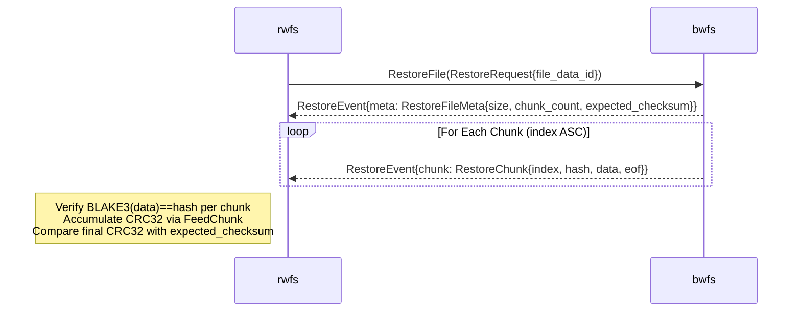

# rwfs verify Implementation Plan

> **For agentic workers:** REQUIRED SUB-SKILL: Use superpowers:subagent-driven-development (recommended) or superpowers:executing-plans to implement this plan task-by-task. Steps use checkbox (`- [ ]`) syntax for tracking.

**Goal:** Add `rwfs verify` — a command that fetches backed-up file chunks from a remote bwfs server via a new RestoreService gRPC protocol and re-verifies BLAKE3 per-chunk and CRC32 whole-file integrity without writing to disk.

**Architecture:** A new `RestoreService` proto streams one file at a time (meta then chunks) over a shared gRPC connection. `rwfs verify` uses a worker pool (`--streams N`) to verify files concurrently, accumulating CRC32 the same way bwfs does during backup, and exits non-zero if any file fails.

**Tech Stack:** Go, gRPC/protobuf, `lukechampine.com/blake3`, `hash/crc32`, `sync.WaitGroup`, `log/slog`, Docker e2e tests.

## Global Constraints

- Module path: `github.com/alex-sviridov/miniprotector`
- All proto files go in `src/api/`, generated with `make proto` (runs `protoc --go_out=. --go_opt=paths=source_relative --go-grpc_out=. --go-grpc_opt=paths=source_relative api/*.proto` from `src/`)
- All proto files use `option go_package = "./proto"` → generated Go package is `proto`, imported as `pb "github.com/alex-sviridov/miniprotector/api"`
- Chunk size is 64KB (`workload/filesystem.ChunkSize = 64 * 1024`)
- File-level checksum: CRC32-IEEE of chunk-CRC32s fed big-endian via `FeedChunk`, stored as 4-byte big-endian in `FileDataRecord.Checksum`
- E2e tests: build tag `e2e`, run with `make test-e2e`; unit/integration tests run with `make test`
- All source code lives under `src/`; build/test commands run from repo root via `make`
- Reliability first, simplicity second, performance third

---

## File Map

| Path | Status | Responsibility |
|------|--------|----------------|
| `src/common/checksum/checksum.go` | **New** | `FeedChunk` — shared CRC32 accumulator helper |
| `src/api/restore.proto` | **New** | `RestoreService` proto definition |
| `src/api/restore.pb.go` | **Generated** | Proto message types |
| `src/api/restore_grpc.pb.go` | **Generated** | gRPC client/server stubs |
| `src/cmd/bwfs/restoreserver.go` | **New** | `RestoreService` gRPC handler |
| `src/cmd/bwfs/handler.go` | **Modify** | Replace local `feedChecksum` with `checksum.FeedChunk` |
| `src/cmd/bwfs/main.go` | **Modify** | Open restore store, register `RestoreService` |
| `src/cmd/rwfs/verify.go` | **New** | `runVerify`, `verifyFile`, worker pool |
| `src/cmd/rwfs/arguments.go` | **Modify** | Add `verify` subcommand, `Streams`/`Retries` fields |
| `src/cmd/rwfs/main.go` | **Modify** | Wire `verify` action |
| `src/e2e/Dockerfile` | **Modify** | Build and copy `rwfs` binary |
| `src/e2e/docker.go` | **Modify** | `runRwfsVerifyContainer`, `corruptOneChunk` helpers |
| `src/e2e/e2e_test.go` | **Modify** | Two new verify test functions |
| `docs/protocols/restore.md` | **New** | Restore protocol doc |
| `docs/components/rwfs.md` | **Modify** | Document verify subcommand |
| `docs/components/bwfs.md` | **Modify** | Document RestoreService |
| `README.md` | **Modify** | Quick-start verify example, restore protocol link |
| `docs/ARCHITECTURE.md` | **Modify** | rwfs restore is no longer planned |

---

## Task 1: Extract `feedChecksum` to `common/checksum`

Both `bwfs` (during backup) and `rwfs` (during verify) must accumulate CRC32 identically. The existing `feedChecksum` in `bwfs/handler.go` is a private function in `package main` and cannot be imported. This task extracts it to a shared package.

**Files:**
- Create: `src/common/checksum/checksum.go`
- Modify: `src/cmd/bwfs/handler.go`

**Interfaces:**
- Produces: `checksum.FeedChunk(h hash.Hash32, chunkCRC uint32)` — consumed by Task 3 (bwfs handler) and Task 4 (rwfs verify)

- [ ] **Step 1: Create `src/common/checksum/checksum.go`**

```go
package checksum

import (
	"encoding/binary"
	"hash"
)

// FeedChunk writes a chunk's CRC32 as 4-byte big-endian into a running file-level CRC32 hasher.
// Call once per chunk in index order; the final Sum32() matches FileDataRecord.Checksum.
func FeedChunk(h hash.Hash32, chunkCRC uint32) {
	var buf [4]byte
	binary.BigEndian.PutUint32(buf[:], chunkCRC)
	h.Write(buf[:])
}
```

- [ ] **Step 2: Update `src/cmd/bwfs/handler.go`**

Add the import (keep all existing imports, add one):
```go
import (
    // ... existing imports ...
    "github.com/alex-sviridov/miniprotector/common/checksum"
)
```

Replace the two `feedChecksum` call sites:

In `handleChunkHashRequest` (around line 161):
```go
// Before:
feedChecksum(h.fileChecksumHasher, chunk.Checksum)
// After:
checksum.FeedChunk(h.fileChecksumHasher, chunk.Checksum)
```

In `handleChunkDataRequest` (around line 194):
```go
// Before:
feedChecksum(h.fileChecksumHasher, crc32.ChecksumIEEE(chunk.Data))
// After:
checksum.FeedChunk(h.fileChecksumHasher, crc32.ChecksumIEEE(chunk.Data))
```

Delete the `feedChecksum` function at the bottom of the file (lines 252–258):
```go
// DELETE this entire function:
func feedChecksum(h hash.Hash32, checksum uint32) {
	var buf [4]byte
	binary.BigEndian.PutUint32(buf[:], checksum)
	h.Write(buf[:])
}
```

- [ ] **Step 3: Verify it compiles and tests pass**

```bash
make build
make test
```

Expected: all binaries build, `go test ./...` passes.

- [ ] **Step 4: Commit**

```bash
git add src/common/checksum/checksum.go src/cmd/bwfs/handler.go
git commit -m "refactor: extract feedChecksum to common/checksum for shared CRC accumulation"
```

---

## Task 2: Define RestoreService proto and generate code

**Files:**
- Create: `src/api/restore.proto`
- Create (generated): `src/api/restore.pb.go`, `src/api/restore_grpc.pb.go`

**Interfaces:**
- Produces:
  - `pb.RestoreServiceClient` with `RestoreFile(ctx, *pb.RestoreRequest) (pb.RestoreService_RestoreFileClient, error)`
  - `pb.RestoreService_RestoreFileServer` (stream interface for bwfs handler)
  - `pb.RestoreRequest{FileDataId string}`
  - `pb.RestoreEvent` with `GetMeta() *pb.RestoreFileMeta` and `GetChunk() *pb.RestoreChunk`
  - `pb.RestoreFileMeta{Size int64, ChunkCount int32, ExpectedChecksum []byte}`
  - `pb.RestoreChunk{Index int64, Hash []byte, Data []byte, Eof bool}`
  - `pb.RegisterRestoreServiceServer(s *grpc.Server, srv pb.RestoreServiceServer)`

- [ ] **Step 1: Create `src/api/restore.proto`**

```proto
syntax = "proto3";

package restoreservice;

option go_package = "./proto";

service RestoreService {
  rpc RestoreFile(RestoreRequest) returns (stream RestoreEvent);
}

message RestoreRequest {
  string file_data_id = 1;
}

message RestoreEvent {
  oneof payload {
    RestoreFileMeta meta  = 1;
    RestoreChunk    chunk = 2;
  }
}

message RestoreFileMeta {
  int64  size              = 1;
  int32  chunk_count       = 2;
  bytes  expected_checksum = 3;
}

message RestoreChunk {
  int64 index = 1;
  bytes hash  = 2;
  bytes data  = 3;
  bool  eof   = 4;
}
```

- [ ] **Step 2: Generate Go code**

```bash
make proto
```

Expected output: `Protobuf code generated in src/api/`

Verify the generated files exist:
```bash
ls src/api/restore.pb.go src/api/restore_grpc.pb.go
```

- [ ] **Step 3: Verify generated code compiles**

```bash
make build
```

Expected: all three binaries build without errors.

- [ ] **Step 4: Commit**

```bash
git add src/api/restore.proto src/api/restore.pb.go src/api/restore_grpc.pb.go
git commit -m "feat(api): add RestoreService proto and generated code"
```

---

## Task 3: Implement bwfs RestoreService handler and register it

`RestoreService` streams file metadata followed by chunks in index order. bwfs reads chunks from its own storage and sends them. It knows nothing about verification — that's rwfs's responsibility.

**Files:**
- Create: `src/cmd/bwfs/restoreserver.go`
- Modify: `src/cmd/bwfs/main.go`

**Interfaces:**
- Consumes:
  - `pb.RestoreRequest.FileDataId` (string UUID from `FileDataRecord.ID`)
  - `pb.UnimplementedRestoreServiceServer` (embed for forward compatibility)
  - `wfs.Store.RawDB()` for direct GORM queries (same pattern as listserver.go)
  - `wfs.Store.ReadChunk(hash []byte) ([]byte, error)`
  - `pb.RegisterRestoreServiceServer` from Task 2
  - `checksum.FeedChunk` — NOT needed here (bwfs doesn't verify)
- Produces: running `RestoreService` on the same gRPC port as `BackupService` and `ListService`

- [ ] **Step 1: Create `src/cmd/bwfs/restoreserver.go`**

```go
package main

import (
	"encoding/hex"
	"log/slog"

	pb "github.com/alex-sviridov/miniprotector/api"
	wfs "github.com/alex-sviridov/miniprotector/storage/filesystem"
	"google.golang.org/grpc/codes"
	"google.golang.org/grpc/status"
)

type restoreServer struct {
	pb.UnimplementedRestoreServiceServer
	store  *wfs.Store
	logger *slog.Logger
}

func NewRestoreServer(store *wfs.Store, logger *slog.Logger) *restoreServer {
	return &restoreServer{store: store, logger: logger}
}

type fileDataRow struct {
	ID         string `gorm:"column:id"`
	FileID     string `gorm:"column:file_id"`
	Size       int64  `gorm:"column:size"`
	ChunkCount int    `gorm:"column:chunk_count"`
	Checksum   []byte `gorm:"column:checksum"`
}

type chunkLinkRow struct {
	ChunkHash string `gorm:"column:chunk_hash"`
	Index     int64  `gorm:"column:index"`
}

func (s *restoreServer) RestoreFile(req *pb.RestoreRequest, stream pb.RestoreService_RestoreFileServer) error {
	logger := s.logger.With("file_data_id", req.GetFileDataId())

	var fd fileDataRow
	err := s.store.RawDB().Table("file_data_records").
		Select("id, file_id, size, chunk_count, checksum").
		Where("id = ? AND checksum IS NOT NULL", req.GetFileDataId()).
		First(&fd).Error
	if err != nil {
		return status.Errorf(codes.NotFound, "file_data_id not found: %s", req.GetFileDataId())
	}

	if err := stream.Send(&pb.RestoreEvent{
		Payload: &pb.RestoreEvent_Meta{
			Meta: &pb.RestoreFileMeta{
				Size:             fd.Size,
				ChunkCount:       int32(fd.ChunkCount),
				ExpectedChecksum: fd.Checksum,
			},
		},
	}); err != nil {
		return err
	}

	var links []chunkLinkRow
	if err := s.store.RawDB().Table("file_data_chunk_records").
		Select("chunk_hash, `index`").
		Where("file_data_id = ?", fd.FileID).
		Order("`index` ASC").
		Find(&links).Error; err != nil {
		return status.Errorf(codes.Internal, "query chunks: %v", err)
	}

	for i, link := range links {
		hash, err := hex.DecodeString(link.ChunkHash)
		if err != nil {
			return status.Errorf(codes.Internal, "decode chunk hash: %v", err)
		}

		data, err := s.store.ReadChunk(hash)
		if err != nil {
			logger.Error("read chunk failed", "chunk_hash", link.ChunkHash, "error", err)
			return status.Errorf(codes.Internal, "read chunk %s: %v", link.ChunkHash, err)
		}

		eof := i == len(links)-1
		if err := stream.Send(&pb.RestoreEvent{
			Payload: &pb.RestoreEvent_Chunk{
				Chunk: &pb.RestoreChunk{
					Index: link.Index,
					Hash:  hash,
					Data:  data,
					Eof:   eof,
				},
			},
		}); err != nil {
			return err
		}
	}

	logger.Debug("restore stream complete", "chunks", len(links))
	return nil
}
```

- [ ] **Step 2: Register RestoreService in `src/cmd/bwfs/main.go`**

In the `case "server":` block, after the `listSrv` setup and before `connection.StartServer`, add:

```go
restoreStore, err := wfs.NewReadOnly(arguments.StoragePath)
if err != nil {
    logger.Error("Restore store initialization failed", "error", err)
    os.Exit(1)
}
defer restoreStore.Close()
restoreSrv := NewRestoreServer(restoreStore, logger)
```

Then add `pb.RegisterRestoreServiceServer(s, restoreSrv)` inside the `StartServer` callback:

```go
if err := connection.StartServer(ctx, logger, arguments.Port, func(s *grpc.Server) {
    pb.RegisterBackupServiceServer(s, backupServer)
    pb.RegisterListServiceServer(s, listSrv)
    pb.RegisterRestoreServiceServer(s, restoreSrv)
}); err != nil {
```

- [ ] **Step 3: Verify it builds**

```bash
make bwfs
```

Expected: `Built successfully: bin/bwfs`

- [ ] **Step 4: Commit**

```bash
git add src/cmd/bwfs/restoreserver.go src/cmd/bwfs/main.go
git commit -m "feat(bwfs): add RestoreService gRPC handler, register on server port"
```

---

## Task 4: Implement `rwfs verify` command

Three files: `arguments.go` (add subcommand + flags), `main.go` (wire action), `verify.go` (all logic).

**Files:**
- Modify: `src/cmd/rwfs/arguments.go`
- Modify: `src/cmd/rwfs/main.go`
- Create: `src/cmd/rwfs/verify.go`

**Interfaces:**
- Consumes:
  - `pb.NewListServiceClient`, `pb.ListRequest`, `pb.FileRow` from existing list proto
  - `pb.NewRestoreServiceClient`, `pb.RestoreRequest`, `pb.RestoreEvent.GetMeta()`, `pb.RestoreEvent.GetChunk()` from Task 2
  - `checksum.FeedChunk` from Task 1
  - `connection.Connect(host string, port, timeout int) (*grpc.ClientConn, error)`
  - `common.GetHostname() string`
  - `common.ParseServerPath(positional string) (serverName, path string, err error)`
  - `common.ParseDestination(dest, defaultHost string, defaultPort int) (string, int, error)`
  - `common.ValidateStreamsCount(streams int) error`
- Produces: `rwfs verify` subcommand with exit code 0 (all pass) or 1 (any failure)

- [ ] **Step 1: Update `src/cmd/rwfs/arguments.go`**

Replace the file entirely with:

```go
package main

import (
	"fmt"

	"github.com/alex-sviridov/miniprotector/common"
	"github.com/alex-sviridov/miniprotector/common/config"
	"github.com/spf13/cobra"
)

type Arguments struct {
	Action     string // "list" | "verify"
	ServerName string
	PathFilter string
	BwfsHost   string
	BwfsPort   int
	Output     string // "table" | "json" (list only)
	Filter     string
	Debug      bool
	Quiet      bool
	Streams    int // verify only
	Retries    int // verify only

	listPositional string
	bwfsTarget     string
}

func parseArguments(conf *config.Config) (*Arguments, error) {
	args := &Arguments{}

	rootCmd := &cobra.Command{
		Use:   "rwfs <command>",
		Short: "Restore writer filesystem tool",
	}

	listCmd := &cobra.Command{
		Use:   "list [[server_name:]path] <bwfs_host:port>",
		Short: "List files available on a remote bwfs server",
		Args:  cobra.RangeArgs(1, 2),
		Run: func(cmd *cobra.Command, cliArgs []string) {
			args.Action = "list"
			if len(cliArgs) == 1 {
				args.bwfsTarget = cliArgs[0]
			} else {
				args.listPositional = cliArgs[0]
				args.bwfsTarget = cliArgs[1]
			}
		},
	}
	listCmd.Flags().StringVar(&args.Output, "output", "table", "Output format: table or json")
	listCmd.Flags().StringVar(&args.Filter, "filter", "", "Filter by text in file path")
	listCmd.Flags().BoolVar(&args.Debug, "debug", false, "Enable debug logging")
	listCmd.Flags().BoolVar(&args.Quiet, "quiet", false, "Suppress console logging")

	verifyCmd := &cobra.Command{
		Use:   "verify [[server_name:]path] <bwfs_host:port>",
		Short: "Verify integrity of files stored on a remote bwfs server",
		Args:  cobra.RangeArgs(1, 2),
		Run: func(cmd *cobra.Command, cliArgs []string) {
			args.Action = "verify"
			if len(cliArgs) == 1 {
				args.bwfsTarget = cliArgs[0]
			} else {
				args.listPositional = cliArgs[0]
				args.bwfsTarget = cliArgs[1]
			}
		},
	}
	verifyCmd.Flags().StringVar(&args.Filter, "filter", "", "Filter by text in file path")
	verifyCmd.Flags().BoolVar(&args.Debug, "debug", false, "Enable debug logging")
	verifyCmd.Flags().BoolVar(&args.Quiet, "quiet", false, "Suppress per-file success lines (warnings and summary always shown)")
	verifyCmd.Flags().IntVar(&args.Streams, "streams", 4, "Number of concurrent verification workers")
	verifyCmd.Flags().IntVar(&args.Retries, "retries", 3, "Max retry attempts per file on stream error")

	rootCmd.AddCommand(listCmd)
	rootCmd.AddCommand(verifyCmd)

	if err := rootCmd.Execute(); err != nil {
		return nil, err
	}

	if args.Action == "" {
		return nil, fmt.Errorf("a subcommand is required: list, verify")
	}

	if args.Action == "list" {
		if args.Output != "table" && args.Output != "json" {
			return nil, fmt.Errorf("--output must be 'table' or 'json', got: %q", args.Output)
		}
	}

	if args.Action == "verify" {
		if err := common.ValidateStreamsCount(args.Streams); err != nil {
			return nil, fmt.Errorf("--streams: %w", err)
		}
		if args.Retries < 1 {
			return nil, fmt.Errorf("--retries must be at least 1, got: %d", args.Retries)
		}
	}

	serverName, path, err := common.ParseServerPath(args.listPositional)
	if err != nil {
		return nil, fmt.Errorf("positional error: %w", err)
	}
	if serverName == "" {
		serverName = common.GetHostname()
	}
	args.ServerName = serverName
	args.PathFilter = path

	host, port, err := common.ParseDestination(args.bwfsTarget, "localhost", conf.DefaultPort)
	if err != nil {
		return nil, fmt.Errorf("invalid bwfs target: %w", err)
	}
	args.BwfsHost = host
	args.BwfsPort = port

	return args, nil
}
```

- [ ] **Step 2: Update `src/cmd/rwfs/main.go`**

Replace the file entirely with:

```go
package main

import (
	"context"
	"fmt"
	"os"

	"github.com/alex-sviridov/miniprotector/common/config"
	"github.com/alex-sviridov/miniprotector/common/logging"
)

func main() {
	const appName = "rwfs"

	ctx := context.WithValue(context.Background(), "appName", appName)

	configPath, err := config.ResolveConfigPath()
	if err != nil {
		fmt.Fprintf(os.Stderr, "Configuration error: %v\n", err)
		os.Exit(1)
	}

	conf, err := config.ParseConfig(configPath)
	if err != nil {
		fmt.Fprintf(os.Stderr, "Configuration error: %v\n", err)
		os.Exit(1)
	}
	ctx = context.WithValue(ctx, config.ContextKey, conf)

	arguments, err := parseArguments(conf)
	if err != nil {
		fmt.Fprintf(os.Stderr, "Arguments error: %v\n", err)
		os.Exit(1)
	}
	ctx = context.WithValue(ctx, "debugMode", arguments.Debug)

	// verify --quiet only suppresses per-file success lines, not all console output.
	// list --quiet suppresses all console output (original behaviour).
	quietForLogger := arguments.Quiet && arguments.Action != "verify"
	ctx = context.WithValue(ctx, "quietMode", quietForLogger)

	logger, logfile := logging.NewLogger(ctx)
	defer logfile.Close()

	switch arguments.Action {
	case "list":
		if err := runList(arguments.BwfsHost, arguments.BwfsPort, arguments.ServerName, arguments.PathFilter, arguments.Filter, arguments.Output); err != nil {
			logger.Error("List failed", "error", err)
			os.Exit(1)
		}
	case "verify":
		if err := runVerify(logger, arguments.BwfsHost, arguments.BwfsPort, arguments.ServerName, arguments.PathFilter, arguments.Filter, arguments.Streams, arguments.Retries, arguments.Quiet); err != nil {
			logger.Error("Verify failed", "error", err)
			os.Exit(1)
		}
	}
}
```

- [ ] **Step 3: Create `src/cmd/rwfs/verify.go`**

```go
package main

import (
	"bytes"
	"context"
	"encoding/binary"
	"fmt"
	"hash/crc32"
	"log/slog"
	"sync"
	"time"

	pb "github.com/alex-sviridov/miniprotector/api"
	"github.com/alex-sviridov/miniprotector/common/checksum"
	"github.com/alex-sviridov/miniprotector/common/connection"
	"lukechampine.com/blake3"
)

type verifyResult struct {
	fileDataID string
	source     string
	path       string
	ok         bool
	reason     string
	chunkIndex int64
	size       int64
	chunkCount int32
}

func runVerify(logger *slog.Logger, host string, port int, serverName, pathFilter, filter string, streams, retries int, quiet bool) error {
	conn, err := connection.Connect(host, port, 5)
	if err != nil {
		return fmt.Errorf("connect to bwfs: %w", err)
	}
	defer conn.Close()

	listClient := pb.NewListServiceClient(conn)
	ctx, cancel := context.WithTimeout(context.Background(), 30*time.Second)
	resp, err := listClient.ListFiles(ctx, &pb.ListRequest{
		ServerName: serverName,
		Path:       pathFilter,
		Filter:     filter,
	})
	cancel()
	if err != nil {
		return fmt.Errorf("list files: %w", err)
	}

	var rows []*pb.FileRow
	for _, r := range resp.Rows {
		if r.Type == "f" && r.Size > 0 {
			rows = append(rows, r)
		}
	}

	if len(rows) == 0 {
		logger.Info("summary", "verified", 0, "warnings", 0)
		return nil
	}

	restoreClient := pb.NewRestoreServiceClient(conn)
	workCh := make(chan *pb.FileRow, len(rows))
	for _, r := range rows {
		workCh <- r
	}
	close(workCh)

	resultCh := make(chan verifyResult, len(rows))

	var wg sync.WaitGroup
	for i := 0; i < streams; i++ {
		wg.Add(1)
		go func() {
			defer wg.Done()
			for row := range workCh {
				resultCh <- verifyFileWithRetry(context.Background(), logger, restoreClient, row, retries)
			}
		}()
	}

	go func() {
		wg.Wait()
		close(resultCh)
	}()

	total := 0
	warnings := 0
	for result := range resultCh {
		total++
		if result.ok {
			if !quiet {
				logger.Info("verified",
					"source", result.source,
					"path", result.path,
					"file_data_id", result.fileDataID,
					"chunks", result.chunkCount,
					"size", result.size,
				)
			}
		} else {
			warnings++
			attrs := []any{
				"source", result.source,
				"path", result.path,
				"file_data_id", result.fileDataID,
				"reason", result.reason,
			}
			if result.reason == "blake3_mismatch" {
				attrs = append(attrs, "chunk_index", result.chunkIndex)
			}
			logger.Warn("verification failed", attrs...)
		}
	}

	logger.Info("summary", "verified", total, "warnings", warnings)
	if warnings > 0 {
		return fmt.Errorf("%d file(s) failed verification", warnings)
	}
	return nil
}

func verifyFileWithRetry(ctx context.Context, logger *slog.Logger, client pb.RestoreServiceClient, row *pb.FileRow, maxRetries int) verifyResult {
	var result verifyResult
	for attempt := 1; attempt <= maxRetries; attempt++ {
		result = verifyFile(ctx, client, row)
		if result.ok || result.reason == "blake3_mismatch" || result.reason == "crc_mismatch" {
			return result
		}
		if attempt < maxRetries {
			logger.Warn("stream error, retrying",
				"path", row.Path,
				"file_data_id", row.FileDataId,
				"attempt", attempt,
				"reason", result.reason,
			)
		}
	}
	return result
}

func verifyFile(parent context.Context, client pb.RestoreServiceClient, row *pb.FileRow) verifyResult {
	base := verifyResult{
		fileDataID: row.FileDataId,
		source:     row.Source,
		path:       row.Path,
	}

	ctx, cancel := context.WithCancel(parent)
	defer cancel()

	stream, err := client.RestoreFile(ctx, &pb.RestoreRequest{FileDataId: row.FileDataId})
	if err != nil {
		base.reason = fmt.Sprintf("stream error: %v", err)
		return base
	}

	firstEvent, err := stream.Recv()
	if err != nil {
		base.reason = fmt.Sprintf("stream error: %v", err)
		return base
	}
	meta := firstEvent.GetMeta()
	if meta == nil {
		base.reason = "stream error: expected RestoreFileMeta as first event"
		return base
	}
	base.size = meta.Size
	base.chunkCount = meta.ChunkCount

	hasher := crc32.NewIEEE()

	for {
		event, err := stream.Recv()
		if err != nil {
			base.reason = fmt.Sprintf("stream error: %v", err)
			return base
		}
		chunk := event.GetChunk()
		if chunk == nil {
			base.reason = "stream error: expected RestoreChunk"
			return base
		}

		computed := blake3.Sum256(chunk.Data)
		if !bytes.Equal(computed[:], chunk.Hash) {
			base.reason = "blake3_mismatch"
			base.chunkIndex = chunk.Index
			return base
		}

		checksum.FeedChunk(hasher, crc32.ChecksumIEEE(chunk.Data))

		if chunk.Eof {
			break
		}
	}

	var buf [4]byte
	binary.BigEndian.PutUint32(buf[:], hasher.Sum32())
	if !bytes.Equal(buf[:], meta.ExpectedChecksum) {
		base.reason = "crc_mismatch"
		return base
	}

	base.ok = true
	return base
}
```

- [ ] **Step 4: Verify it builds**

```bash
make rwfs
```

Expected: `Built successfully: bin/rwfs`

- [ ] **Step 5: Smoke test the CLI**

```bash
bin/rwfs verify --help
```

Expected output includes:
```
Usage:
  rwfs verify [[server_name:]path] <bwfs_host:port> [flags]

Flags:
      --filter string   Filter by text in file path
      --quiet           Suppress per-file success lines
      --retries int     Max retry attempts per file on stream error (default 3)
      --streams int     Number of concurrent verification workers (default 4)
```

- [ ] **Step 6: Commit**

```bash
git add src/cmd/rwfs/arguments.go src/cmd/rwfs/main.go src/cmd/rwfs/verify.go
git commit -m "feat(rwfs): add verify subcommand with worker pool and CRC32/BLAKE3 integrity check"
```

---

## Task 5: E2E tests for rwfs verify

Two tests: happy path (all files pass) and corruption detection (one chunk corrupted, verify exits non-zero).

**Files:**
- Modify: `src/e2e/Dockerfile`
- Modify: `src/e2e/docker.go`
- Modify: `src/e2e/e2e_test.go`

**Interfaces:**
- Consumes: `runRwfsVerifyContainer` and `corruptOneChunk` (defined in this task, same file)
- Consumes: existing `startBwfsContainer`, `waitForBwfs`, `runBrfsContainer`, `generateTestData`, `createNetwork` helpers

- [ ] **Step 1: Update `src/e2e/Dockerfile` to build rwfs**

Change line 12:
```dockerfile
# Before:
RUN CGO_ENABLED=1 GOOS=linux GOARCH=amd64 make brfs bwfs
# After:
RUN CGO_ENABLED=1 GOOS=linux GOARCH=amd64 make brfs bwfs rwfs
```

Change the COPY line in the runtime stage:
```dockerfile
# Before:
COPY --from=builder /build/bin/brfs /build/bin/bwfs ./
# After:
COPY --from=builder /build/bin/brfs /build/bin/bwfs /build/bin/rwfs ./
```

- [ ] **Step 2: Add `runRwfsVerifyContainer` and `corruptOneChunk` to `src/e2e/docker.go`**

Append to the end of `docker.go` (before the final closing):

```go
// runRwfsVerifyContainer runs `rwfs verify` against the bwfs container and returns the exit code.
// quiet=true passes --quiet (suppress per-file success lines; warnings still shown).
func runRwfsVerifyContainer(ctx context.Context, t testingT, imageID, networkID string, quiet bool) int {
	t.Helper()
	cli := newDockerClient(t)
	defer cli.Close()

	cmd := []string{"/app/rwfs", "verify", "bwfs:15722", "--streams", "4"}
	if quiet {
		cmd = append(cmd, "--quiet")
	}

	resp, err := cli.ContainerCreate(ctx,
		&container.Config{
			Image: imageID,
			Cmd:   cmd,
		},
		&container.HostConfig{},
		&network.NetworkingConfig{
			EndpointsConfig: map[string]*network.EndpointSettings{
				networkID: {NetworkID: networkID},
			},
		},
		nil,
		"",
	)
	require.NoError(t, err)
	defer func() {
		_ = cli.ContainerRemove(context.Background(), resp.ID, container.RemoveOptions{Force: true})
	}()

	require.NoError(t, cli.ContainerStart(ctx, resp.ID, container.StartOptions{}))

	statusCh, errCh := cli.ContainerWait(ctx, resp.ID, container.WaitConditionNotRunning)
	select {
	case err := <-errCh:
		require.NoError(t, err)
	case status := <-statusCh:
		if status.Error != nil {
			t.Logf("rwfs verify error: %s", status.Error.Message)
		}
		logContainerOutput(ctx, t, cli, resp.ID)
		return int(status.StatusCode)
	}
	return -1
}

// corruptOneChunk flips the first byte of the first chunk file found under storageDir/chunks/.
// The storageDir must be host-accessible (bind-mounted from a container or a local t.TempDir()).
func corruptOneChunk(t testingT, storageDir string) {
	t.Helper()
	chunks, err := filepath.Glob(filepath.Join(storageDir, "chunks", "*", "*", "*"))
	require.NoError(t, err)
	require.NotEmpty(t, chunks, "no chunks found in storage dir %s", storageDir)

	chunkPath := chunks[0]
	data, err := os.ReadFile(chunkPath)
	require.NoError(t, err)
	require.NotEmpty(t, data)

	data[0] ^= 0xFF
	require.NoError(t, os.WriteFile(chunkPath, data, 0644))
	t.Logf("corrupted chunk: %s", chunkPath)
}
```

Note: `docker.go` already imports `os`, `path/filepath`, `context`, `fmt`, `net`, etc. Verify no new imports are needed beyond what's already there.

- [ ] **Step 3: Add two test functions to `src/e2e/e2e_test.go`**

Append after `TestE2E_AllFoldersBackup`:

```go
func TestE2E_Verify_HappyPath(t *testing.T) {
	ctx, cancel := context.WithTimeout(context.Background(), 5*time.Minute)
	defer cancel()

	dataDir := t.TempDir()
	generateTestData(t, dataDir)

	networkID := createNetwork(ctx, t)
	storageDir := t.TempDir()

	hostPort := startBwfsContainer(ctx, t, testImageID, networkID, storageDir)
	require.NoError(t, waitForBwfs(ctx, hostPort))

	exitCode := runBrfsContainer(ctx, t, testImageID, networkID,
		filepath.Join(dataDir, "subA"), "bwfs", 4)
	require.Equal(t, 0, exitCode, "brfs should exit 0")

	exitCode = runRwfsVerifyContainer(ctx, t, testImageID, networkID, false)
	require.Equal(t, 0, exitCode, "rwfs verify should pass on clean backup")
}

func TestE2E_Verify_CorruptionDetection(t *testing.T) {
	ctx, cancel := context.WithTimeout(context.Background(), 5*time.Minute)
	defer cancel()

	dataDir := t.TempDir()
	generateTestData(t, dataDir)

	networkID := createNetwork(ctx, t)
	storageDir := t.TempDir()

	hostPort := startBwfsContainer(ctx, t, testImageID, networkID, storageDir)
	require.NoError(t, waitForBwfs(ctx, hostPort))

	// Back up subA only (8 files, known chunk layout)
	exitCode := runBrfsContainer(ctx, t, testImageID, networkID,
		filepath.Join(dataDir, "subA"), "bwfs", 1)
	require.Equal(t, 0, exitCode, "brfs should exit 0")

	// Confirm baseline passes
	exitCode = runRwfsVerifyContainer(ctx, t, testImageID, networkID, true)
	require.Equal(t, 0, exitCode, "baseline verify should pass")

	// Corrupt one chunk on the host filesystem (shared with the container via bind mount)
	corruptOneChunk(t, storageDir)

	// Verify must now detect the corruption and exit non-zero
	exitCode = runRwfsVerifyContainer(ctx, t, testImageID, networkID, false)
	require.NotEqual(t, 0, exitCode, "verify must fail when a chunk is corrupted")
}
```

- [ ] **Step 4: Run e2e tests**

```bash
make test-e2e
```

Expected: all four e2e tests pass including `TestE2E_Verify_HappyPath` and `TestE2E_Verify_CorruptionDetection`.

If `TestE2E_Verify_CorruptionDetection` fails with exit code 0 (corruption not detected), check:
1. That the chunk file was corrupted on the HOST (not inside the container — storageDir is bind-mounted)
2. That `corruptOneChunk` found a file under `chunks/aa/bb/rest` (three path levels)
3. That the file backed up has at least one chunk (files in testdata are 4MB–32MB, all multi-chunk)

- [ ] **Step 5: Commit**

```bash
git add src/e2e/Dockerfile src/e2e/docker.go src/e2e/e2e_test.go
git commit -m "test(e2e): add rwfs verify happy-path and corruption-detection tests"
```

---

## Task 6: Documentation

Update all docs per CLAUDE.md rules: new proto → new protocol doc; new command → component docs + README; topology change → ARCHITECTURE.

**Files:**
- Create: `docs/protocols/restore.md`
- Modify: `docs/components/rwfs.md`
- Modify: `docs/components/bwfs.md`
- Modify: `README.md`
- Modify: `docs/ARCHITECTURE.md`

- [ ] **Step 1: Create `docs/protocols/restore.md`**

```markdown
# Restore Subprotocol - Design Overview

## Core Concept

A server-streaming gRPC RPC (`RestoreService.RestoreFile`) that sends file metadata
followed by all chunks for a single file in index order. `bwfs` serves the data as-is;
it does not verify integrity before sending. The caller is responsible for any
integrity checks.

`RestoreService` is registered on the same `grpc.Server` as `BackupService` and
`ListService`, so no additional port or process is needed.

## Protocol Definition

```proto
service RestoreService {
  rpc RestoreFile(RestoreRequest) returns (stream RestoreEvent);
}

message RestoreRequest {
  string file_data_id = 1;  // FileDataRecord.ID from ListResponse
}

message RestoreEvent {
  oneof payload {
    RestoreFileMeta meta  = 1;  // first event only
    RestoreChunk    chunk = 2;  // one per chunk, in index order
  }
}

message RestoreFileMeta {
  int64  size              = 1;
  int32  chunk_count       = 2;
  bytes  expected_checksum = 3;  // 4-byte big-endian CRC32 from FileDataRecord.Checksum
}

message RestoreChunk {
  int64 index = 1;  // byte offset of this chunk in the original file
  bytes hash  = 2;  // BLAKE3 hash from storage (for client-side integrity check)
  bytes data  = 3;
  bool  eof   = 4;  // true on the last chunk
}
```

## Protocol Flow



## Error Handling

| Condition | bwfs behaviour |
|-----------|----------------|
| `file_data_id` not found or not finalized | gRPC `NotFound` |
| Chunk file missing or unreadable | gRPC `Internal` (stream terminates) |
| Send error (network) | stream terminates; client retries entire `RestoreFile` call |

## CLI → RPC Mapping

`rwfs verify` calls `ListService.ListFiles` first (same filters as `rwfs list`), then
calls `RestoreFile` for each returned `file_data_id`:

```
rwfs verify myhost:/var/log localhost:8080 --filter nginx
  1. ListFiles{server_name="myhost", path="/var/log", filter="nginx"}
  2. For each FileRow: RestoreFile{file_data_id=row.file_data_id}
```

## Key Design Decisions

**Why server-streaming per file instead of bidi streaming?**
One stream per file means a stream error affects only one file. The worker pool in rwfs
handles concurrency without needing multiplexed bidi state.

**Why does bwfs send the BLAKE3 hash alongside chunk data?**
So the client can detect storage-level corruption (bytes that changed after the chunk was
stored) without prior knowledge of the expected hash.

**Why does bwfs not re-verify BLAKE3 before sending?**
bwfs trusts its own storage. Detecting corruption after the fact is exactly the purpose
of `rwfs verify`.

**Why is `expected_checksum` sent in `RestoreFileMeta` rather than a separate RPC?**
Collocating the checksum with the stream eliminates an extra round-trip and lets the
client verify atomically at the end of each stream.
```

- [ ] **Step 2: Update `docs/components/rwfs.md`**

Add a `verify` section after the existing `list` section. Read the file first to find the exact location, then add:

```markdown
## verify

Verifies the integrity of files stored on a remote `bwfs` server. Fetches each file's
chunks via the [Restore Protocol](../protocols/restore.md) and re-verifies both per-chunk
BLAKE3 hashes and the whole-file CRC32 checksum — without writing to disk.

```bash
# Verify all files backed up from the current host
rwfs verify localhost:8080

# Verify files from a specific host and path prefix
rwfs verify myhost:/var/log localhost:8080

# Verify with 8 concurrent streams, suppress per-file success lines
rwfs verify localhost:8080 --streams 8 --quiet
```

Exits 0 if all files pass. Exits 1 if any file fails (BLAKE3 mismatch, CRC32 mismatch,
or stream error after retries). Per-file results and a summary are written via `slog`.

### Flags

| Flag | Default | Description |
|------|---------|-------------|
| `--filter` | | Substring filter on file path |
| `--streams` | 4 | Concurrent verification workers |
| `--retries` | 3 | Max retry attempts per file on stream error |
| `--quiet` | false | Suppress per-file success lines (warnings and summary always shown) |
```

- [ ] **Step 3: Update `docs/components/bwfs.md`**

Add a note that `bwfs server` also serves `RestoreService` alongside `BackupService`
and `ListService`. Read the file first, find the server section, then add a sentence:

```markdown
The server registers `BackupService`, `ListService`, and `RestoreService` on the same
port. See [Restore Protocol](../protocols/restore.md) for the restore subprotocol.
```

- [ ] **Step 4: Update `README.md`**

In the Quick Start section, add a verify example after the list examples:

```markdown
**Verify backup integrity:**
```bash
# Verify all files backed up from the current host
rwfs verify localhost:8080

# Verify with 8 concurrent workers, suppress success lines
rwfs verify localhost:8080 --streams 8 --quiet
```
```

In the Documentation section, add a link:
```markdown
- **[Restore Protocol](docs/protocols/restore.md)** - rwfs → bwfs restore/verify subprotocol
```

- [ ] **Step 5: Update `docs/ARCHITECTURE.md`**

Change rwfs restore status from `planned` to `implemented`. Update the Components table:

```markdown
| rwfs | Restore Writer for File System — queries bwfs (list, verify; restore TBD) | list + verify implemented; full restore not yet implemented |
```

Update the mermaid diagram: change `rwfs` node from `planned` class to `component` class, and change the comment from `planned` to `list/verify implemented`:

```mermaid
    classDef component fill:#f3e5f5
    class rwfs component
```

- [ ] **Step 6: Commit docs**

```bash
git add docs/protocols/restore.md docs/components/rwfs.md docs/components/bwfs.md README.md docs/ARCHITECTURE.md
git commit -m "docs: add restore protocol doc, update rwfs/bwfs component docs and README for verify"
```

---

## Self-Review Checklist

Run through these before claiming done:

- [ ] `make build` produces all three binaries with no errors
- [ ] `make test` passes (unit + integration tests)
- [ ] `make lint` passes (`go vet ./...`)
- [ ] `make test-e2e` passes all four tests
- [ ] `bin/rwfs verify --help` shows `--streams`, `--retries`, `--quiet`
- [ ] `bin/rwfs list` still works (no regression from arguments.go changes)
- [ ] All six commits are present in `git log --oneline`
